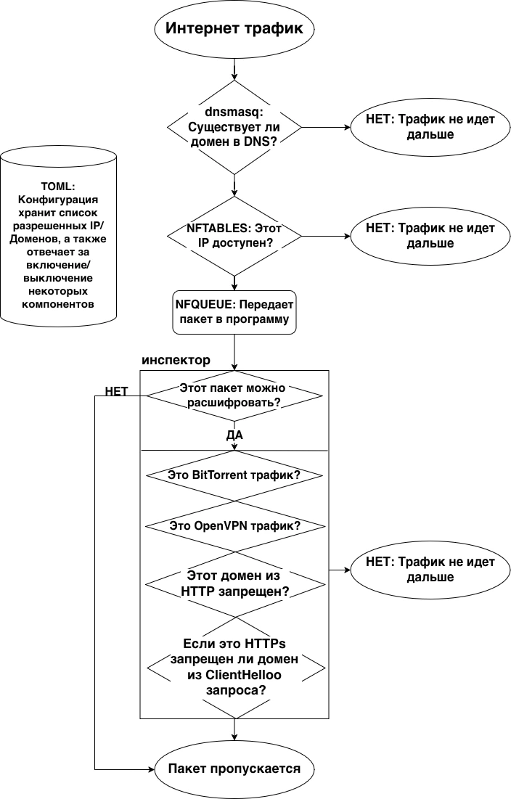

# DPI Traffic Filter Prototype


Учебный DPI-прототип на Go для глубокой фильтрации сетевого трафика. Проект демонстрирует многоуровневую блокировку по доменам, IP-адресам и сигнатурам протоколов через `dnsmasq`, `nftables` и `NFQUEUE`.

Это не промышленный DPI и не готовый корпоративный фильтр. Цель репозитория - показать архитектуру, реализацию и тестирование сетевого фильтра в рамках курсового проекта.





## Возможности

- DNS-блокировка доменов через генерацию конфига `dnsmasq`.
- IP-блокировка через `nftables` set и правило `drop`.
- Передача пакетов в пользовательское пространство через `NFQUEUE`.
- Stateless-анализ payload на уровне отдельного пакета.
- Детектирование и блокировка:
  - BitTorrent handshake по сигнатуре `\x13BitTorrent protocol`;
  - OpenVPN control-пакетов поверх TCP и UDP;
  - HTTP по заголовку `Host`;
  - TLS по SNI из `ClientHello`.
- Единый TOML-конфиг для основных подсистем.
- Unit, integration и PCAP-based тесты.
- Docker Compose окружение для Linux-зависимых проверок.

## Требования

Для разработки и тестирования:

- Go `1.26` или совместимая версия, указанная в `go.mod`;
- `make`;
- Docker и Docker Compose для контейнерного запуска.

Для реального запуска DPI-модулей нужны Linux-компоненты:

- `dnsmasq`;
- `nftables`;
- поддержка Netfilter Queue;
- права root или privileged-контейнер.

На macOS можно запускать unit-тесты и программу с выключенными `dns` и `firewall`, но реальный перехват пакетов через NFQUEUE доступен только на Linux.

## Быстрый старт


```bash
go mod download

make test

make build

make run CONFIG=configs/dpi.toml
```

В `configs/dpi.toml` по умолчанию выключены `dns` и `firewall`, чтобы проект можно было запускать без Linux-привилегий. Инспектор при этом стартует, но без правила `nftables` пакеты в NFQUEUE передаваться не будут.

## Docker

Собрать контейнер:

```bash
make docker-build
```

Запустить тестовую схему `dpi + client + target`:

```bash
make docker-up
```

Запустить тесты в контейнере:

```bash
make docker-unit
make docker-integration
```

Подробности по Docker-окружению, локальным именам образов, Colima описаны в [docker/README.md](docker/README.md).


## Конфигурация

Основные файлы:

- `configs/dpi.toml` - локальный конфиг для разработки;
- `configs/dpi.docker.toml` - конфиг для Docker-среды;
- `configs/CONFIG.md` - полное описание схемы TOML.

Минимальная структура:

```toml
[app]
log_level = "info"

[dns]
enabled = false
blocked_domains = ["blocked.example", "rutracker.org"]

[firewall]
enabled = false
blocked_ips = ["203.0.113.10"]

[inspector]
enabled = true
queue_num = 0
fail_open = true
mode = "skeleton"
```

Важные параметры:

- `dns.blocked_domains` используется и для `dnsmasq`, и для HTTP/TLS доменной фильтрации.
- `firewall.blocked_ips` добавляется в `nftables` set.
- `inspector.queue_num` должен совпадать с номером NFQUEUE-правила.
- `inspector.fail_open = true` пропускает пакеты при ошибках парсинга; `false` блокирует их.

## Как работает фильтрация

При старте программа читает TOML-конфиг один раз, валидирует его и запускает включенные подсистемы.

1. DNS-модуль генерирует правила `dnsmasq` вида `address=/domain/0.0.0.0`.
2. Firewall-модуль создает таблицу, chain, set и правила `nftables` для IP-блокировки и NFQUEUE.
3. Inspector получает пакеты из NFQUEUE, извлекает TCP/UDP payload через `gopacket` и последовательно проверяет сигнатуры.
4. Для каждого пакета возвращается один из двух вердиктов: `accept` или `drop`.

Порядок проверок в инспекторе:

1. BitTorrent handshake.
2. OpenVPN signature.
3. HTTP `Host`.
4. TLS `ClientHello` SNI.
5. `accept`, если совпадений нет.

## OpenVPN detection

OpenVPN определяется без состояния сессии, только по текущему пакету. Для UDP проверяется минимальная структура управляющего пакета: `opcode + key_id`, ненулевой `session_id` и базовые эвристики против текстовых протоколов и TLS. Для TCP дополнительно проверяется двухбайтовая длина OpenVPN-frame.

DATA-пакеты OpenVPN намеренно не классифицируются без контекста сессии, чтобы уменьшить риск ложных срабатываний.

## Тестирование

Обычный набор тестов:

```bash
make test
```

Что покрывается:

- `internal/config` - парсинг TOML, значения по умолчанию, валидация и неизвестные ключи;
- `internal/dns` - генерация `dnsmasq`-конфига и reload-команда;
- `internal/firewall` - команды `nftables`, idempotent-поведение и NFQUEUE-правила;
- `internal/inspector` - BitTorrent, OpenVPN, HTTP Host, TLS SNI и общая логика вердиктов.

Интеграционные тесты с тегом `integration`:

```bash
make test-integration
```

Часть интеграционных тестов требует Linux, `nft` и root/privileged-окружение. На остальных ОС такие тесты будут пропущены или их стоит запускать через Docker:

```bash
make docker-integration
```

PCAP-fixtures лежат в `tests/pcap`. Они используются для проверки, что инспектор корректно выносит `drop` по реальным сохраненным пакетам:

- `http_blocked.pcap` -> `http_host_blocked`;
- `tls_blocked.pcap` -> `tls_sni_blocked`;
- `bittorrent.pcap` -> `bittorrent_signature`;
- `openvpn.pcap` -> `openvpn_signature`.

## Структура проекта

```text
.
├── cmd/dpi/                # Точка входа CLI
├── configs/                # TOML-конфиги и документация схемы
├── docker/                 # Dockerfile, compose и тестовая сеть
├── internal/
│   ├── config/             # Загрузка и валидация TOML
│   ├── dns/                # Генерация dnsmasq-конфига
│   ├── firewall/           # Управление nftables
│   ├── inspector/          # Анализ пакетов и протокольные детекторы
│   ├── logger/             # Настройка slog
│   └── runner/             # Абстракция запуска системных команд
├── tests/
│   ├── integration/        # Интеграционные тесты
│   └── pcap/               # PCAP-fixtures для инспектора
├── Makefile
├── go.mod
└── go.sum
```

## Ограничения

- Поддерживается только Linux для реального DPI-перехвата.
- Конфиг применяется только при старте, hot reload не реализован.
- Инспектор stateless: нет TCP stream reassembly и состояния соединений.
- TLS фильтруется только по открытому SNI в `ClientHello`.
- TLS-расшифровка, ECH, DoH/DoT-фильтрация не реализованы.
- DNS-блокировка работает только если клиент использует DNS-сервер системы.
- BitTorrent и OpenVPN определяются сигнатурно/эвристически, поэтому возможны false positive и false negative.
- Производительность не оптимизировалась под высоконагруженный production-трафик.

## Полезные команды

```bash
make fmt              # go fmt ./...
make test             # обычные тесты
make test-integration # integration-тесты с build tag
make docker-build     # сборка Docker-образа
make docker-up        # запуск compose-окружения
make docker-unit      # unit-тесты в контейнере
make docker-integration
```
